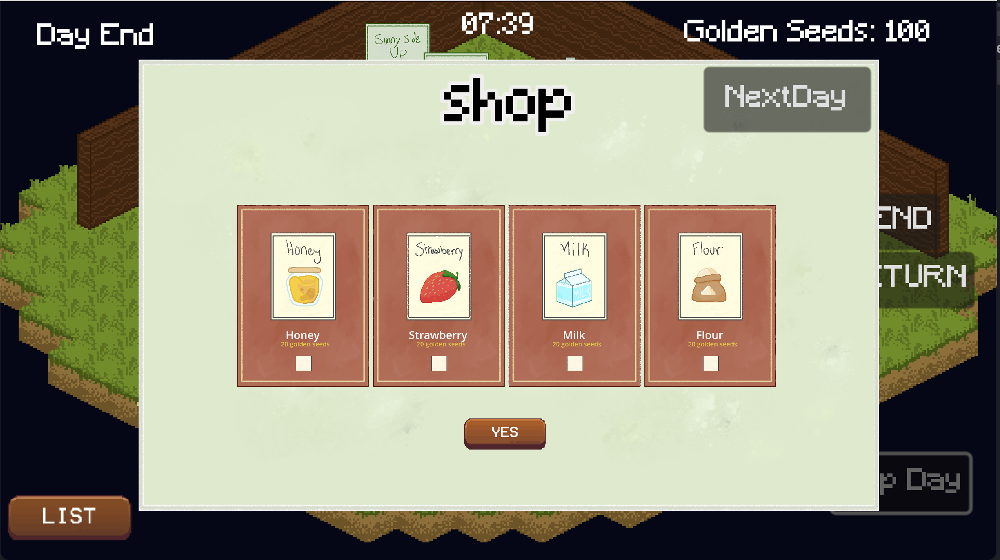

# Cafepillar #

## Summary ## 

The end of spring is coming, and your caterpillar friends have yet to transform into their butterfly forms! The God of Metamorphosis has tasked you with helping them by running the caterpillar cafe; only by feeding them enough to transform before summer begins will this God grant you the mercy of transforming yourself!
To escape this caterpillar fate, you must listen to what your fellow caterpillars are requesting, as they need very particular meals to grow. Then, use the surplus of fresh ingredients (courtesy of your God!) to follow the recipes of the food that’s been requested. Be sure to cook it to perfection to get the greatest quality meal! Serve the completed food the caterpillars and they will reward you with Golden Seeds, which you will collect as proof of your service. Earn enough Golden Seeds in the three days before summer or you’ll be stuck as a little caterpillar forever!

## Project Resources ##
| Resource                                            | Description                                                                    | Link         |
|-----------------------------------------------------|--------------------------------------------------------------------------------|--------------|
| 
Web-playable version
 | 
Hosted on the best* indie game dev website!
 | [Link](https://aroshia.itch.io/cafepillar?secret=sxRkwzsfKWNpgYkhKWZI1OWhH0) |
| 
Trailer
              | 
"Historically" accurate gameplay footage
    | [Link](https://youtu.be/aDJ_-KLX_5c)  |
| 
Press Kit
        | 
A showcase of our game
                      | [Link](https://github.com/TeamCaterpillar/Cafepillar/blob/1f56d638723ec2c0116c272568b60dbe65acfa32/PressKit.md) |
| 
Proposal
                            | 
Prompted by a Hungry hungry caterpillar fever dream (and our games music)
 |   [Link](https://docs.google.com/document/d/1RK9_fZNIhu6455-4KIbZJjABS-V4PLPm4asVfd11XNw/edit?usp=sharing) |

&nbsp;&nbsp;&nbsp;&nbsp;\* itch.io can be taken down by ~~Funko Pops~~ a company we will not name with the click of a button

## Gameplay Explanation ##

Welcome to Cafepillar! Upon opening the game, you will see the Front of House, where your caterpillar customers will enter and sit! They each have their own order request, with a timer above their heads indicating how long they will wait.

To play the game, please press the [P] key on your keyboard to enter the Kitchen! This is where all your cooking will happen. You will see the customers and their orders on the right, as well as the time left. Each order has a unique recipe, which can be accessed in the Recipe Book by clicking the recipe book button on the left. Verify the ingredients you need as well as the appliance to use.

Once you know what you're looking for, search through your deck of cards! You will have five on hand at all times, and you can cycle through five at a time by clicking on your deck of ingredients on the right next to the order queue. Use your mouse to click, drag, and drop the desired ingredients onto the correct appliance slot! Don't worry if you've added the wrong ingredients; click the red [X] button next to the appliance, and the cards will return to your hand. Ingredients also automatically refresh, so you can add multiple of the same ingredient.

When you're ready to let it cook, click the green checkmark button next to the appliance. If it matches the recipe, it'll begin cooking! A timer will appear on the left side to indicate its status. If you pull it off the appliance when the timer is yellow, it'll be undercooked; for blue, it's satisfactory; for green, it's perfect; and for red, it's overdone. This will affect how many Golden Seeds (your currency!) you will earn from serving the customer.

After it's pulled off of the appliance, it'll be added to your hand again above your ingredients. Remember to drag the dish to your serving tray on the top right to bring it to the Front of House! Press [P] on your keyboard again to return to the front, where your customers are waiting.

To serve your hungry caterpillars, click on your list of customers with the [LIST] button on the bottom left. This will show your inventory of dishes on the left and your customer list on the right. Select the dish and the corresponding customer, and click the [YES] button to confirm! Congratulations, you've just served your caterpillar guest! Based on the quality of your cooking, you'll receive Golden Seeds.

When the work day ends, a shop will appear on your screen. Here, you can select more ingredients to buy, which will give you access to more recipes for dishes that'll earn you more Golden Seeds! Select the ingredients you want to acquire and click [YES] to buy, and/or click the [NEXT DAY] button on the top right to continue to the next work day.

(A brief cutscene is also available to be seen by pressing [C] on your keyboard! When you enter, click the dialogue box to continue. When it is complete, press [C] again to return to your game. Do keep in mind that your customers and kitchen will continue working while you're away!)

That is the main game of Cafepillar! Be sure to manage your time well by cooking dishes at the same time on all the appliances, and choose the customers you are able to serve wisely! We hope these instructions were clear and that you enjoy :)

**Add it here if you did work that should be factored into your grade but does not fit easily into the proscribed roles! Please include links to resources and descriptions of game-related material that does not fit into roles here.**

![alt text][logo]

[logo]: https://octodex.github.com/godotocat/ "GodotCat"

# Main Roles #

  
<bold>List of members</bold>

  Detailed explanation of the pathfinding implementation.

Your goal is to relate the work of your role and sub-role in terms of the content of the course. Please look at the role sections below for specific instructions for each role.

Below is a template for you to highlight items of your work. These provide the evidence needed for your work to be evaluated. Try to have at least four such descriptions. They will be assessed on the quality of the underlying system and how they are linked to course content.

*Short Description* - Long description of your work item that includes how it is relevant to topics discussed in class. [link to evidence in your repository](https://github.com/dr-jam/ECS189L/edit/project-description/ProjectDocumentTemplate.md)

Here is an example:  
*Procedural Terrain* - The game's background consists of procedurally generated terrain produced with Perlin noise. The game can modify this terrain at run-time via a call to its script methods. The intent is to allow the player to modify the terrain. This system is based on the component design pattern and the procedural content generation portions of the course. [The PCG terrain generation script](https://github.com/dr-jam/CameraControlExercise/blob/513b927e87fc686fe627bf7d4ff6ff841cf34e9f/Obscura/Assets/Scripts/TerrainGenerator.cs#L6).

You should replay any **bold text** with your relevant information. Liberally use the template when necessary and appropriate.

## Producer, Art Lead, Customer Creation

### Lynn Nguyen

As the producer and main art lead, I was responsible for ensuring the development of our game and its progress went smoothly while also achieving our desired vision for the final build. I also covered the creation of customers and other aspects that would help build the direction of our game, so that other team members could focus on their tasks.

**Task Assignment and Meeting Management**

Meetings were arranged through server messaging on Discord, where we discussed times that we could meet in person as well as times that we would be available to voice call. The rundown of the meetings and what we would be focusing on until the next meeting / until we chat again on Discord was recorded on a Google Doc that was shared with the whole team. I ensured that there was little to no period where there wasn't an aspect of the game being worked on, so that everyone could contribute to the game's progress. In the little time we had, we met frequently, and also communicated frequently on the Discord server so that we'd be updated on when to push our commits and what progress we had made. [Link to the meeting document](https://docs.google.com/document/d/1TilmznogUNGpEh3uqsrBoqjIZ_jFL7WQmL6nhFZnY2g/edit?usp=sharing)

**Art Direction and Creation**

To fully realize our plans of creating a caterpillar themed cafe, I contributed to the assets that would connect the gameplay to the main premise of the game. Our biggest inspiration was the original Very Hungry Caterpillar book, an artstyle that's incredibly bright and colorful with a mixture of textures on top of the shapes of each object. I ensured this would come through in the [kitchen's background](https://github.com/TeamCaterpillar/Cafepillar/blob/fda116d96a4094ebc963607d4310e7a20bb96eaf/Cafepillar_Game/assets/backgrounds/kitchen_background.png) as well as the [transitional scene](https://github.com/TeamCaterpillar/Cafepillar/blob/fda116d96a4094ebc963607d4310e7a20bb96eaf/Cafepillar_Game/assets/transition_screen2.png) between the front of the house and the kitchen. I also worked on the [appliance assets in the kitchen](https://github.com/TeamCaterpillar/Cafepillar/tree/fda116d96a4094ebc963607d4310e7a20bb96eaf/Cafepillar_Game/assets/kitchen_equipment).

Our second desired style was a pixel-art style that would fit our desired isometric top-down view of the cafe front. We decided on a pixel style for the front of house as a way to differentiate the two areas of gameplay and also fitting the grid movement that we have for the customers. I maintained the colorful style of our assets in the tileset of the front of house, and I also drew the [artwork of the dishes and ingredients in a pixelated style](https://github.com/TeamCaterpillar/Cafepillar/tree/fda116d96a4094ebc963607d4310e7a20bb96eaf/Cafepillar_Game/assets/cards) to match. This also goes for [our customers](https://github.com/TeamCaterpillar/Cafepillar/blob/fda116d96a4094ebc963607d4310e7a20bb96eaf/Cafepillar_Game/assets/sprites/customer.png) and our [player character](https://github.com/TeamCaterpillar/Cafepillar/blob/fda116d96a4094ebc963607d4310e7a20bb96eaf/Cafepillar_Game/assets/sprites/player.png), which were drawn to be pixelated animated colors in the same bright tone as the Very Hungry Caterpillar.

**Customer Creation**

I ensured that the customers can be created through a customer factory. Customer each have [designated variables](https://github.com/TeamCaterpillar/Cafepillar/blob/fda116d96a4094ebc963607d4310e7a20bb96eaf/Cafepillar_Game/scripts/characters/customer.gd#L9) for the amount of time they will wait for their order as well as the name of the order they want. Based on this and [the specifications class for the customer](https://github.com/TeamCaterpillar/Cafepillar/blob/fda116d96a4094ebc963607d4310e7a20bb96eaf/Cafepillar_Game/scripts/specs/customer_basic_spec.gd#L13), we can [create customers on command](https://github.com/TeamCaterpillar/Cafepillar/blob/fda116d96a4094ebc963607d4310e7a20bb96eaf/Cafepillar_Game/scripts/factories/customer_factory.gd#L7) so we can control when they are created as well as what they order. This also allows for [random generation of customers](https://github.com/TeamCaterpillar/Cafepillar/blob/fda116d96a4094ebc963607d4310e7a20bb96eaf/Cafepillar_Game/scripts/factories/customer_factory.gd#L15) so that they are spawned with random order requests and are given the corresponding wait time for the dish they want. [Customers are spawned in the front_manager](https://github.com/TeamCaterpillar/Cafepillar/blob/fda116d96a4094ebc963607d4310e7a20bb96eaf/Cafepillar_Game/scripts/managers/front_manager.gd#L69) after the specified spawn timer has finished, the number of customers is sparse, the day hasn't ended and there are still seats available. When this occurs, [a signal is sent to the order queue that a customer has been created](https://github.com/TeamCaterpillar/Cafepillar/blob/fda116d96a4094ebc963607d4310e7a20bb96eaf/Cafepillar_Game/scripts/managers/front_manager.gd#L80). The signal also sends the specifications of the randomly generated customer.

**Customer Orders to Kitchen Queue**

I made sure that the customers orders would be reflected in the queue that is on display in the kitchen scene. The signal that is emitted from the front manager is connected to the order_queue script, which calls the [_add_order method](https://github.com/TeamCaterpillar/Cafepillar/blob/fda116d96a4094ebc963607d4310e7a20bb96eaf/Cafepillar_Game/scripts/ui/order_queue.gd#L34). This method receives the name and the wait time of the order corresponding with the customer and loads it into the order_card instance, which allows the order_card to display the image of the dish in queue as well as the amount of time that the order card starts with.

## User Interface and Input

**Describe your user interface and how it relates to gameplay. This can be done via the template.**
**Describe the default input configuration.**

**Add an entry for each platform or input style your project supports.**

## Movement/Physics

**Describe the basics of movement and physics in your game. Is it the standard physics model? What did you change or modify? Did you make your movement scripts that do not use the physics system?**

## Animation and Visuals

**List your assets, including their sources and licenses.**

**Describe how your work intersects with game feel, graphic design, and world-building. Include your visual style guide if one exists.**

## Kitchen Mechanics/Logic

### Minh Nguyen

Taking the main responsibility of implementing the kitchen logic, I was tasked with creating and connecting different kitchen appliances and components through scripts in order to ensure a smooth gameplay process for when the player heads to the kitchen to create food items to fulfill customer orders at the front of house.

**Cooking Appliances**

Working to extend the script gcard_hand_layout.gd provided by Emma that manages the card hand and card dragging mechanics, I implemented drop handlers that are specific to each of the drop locations in the kitchen scene. For appliances, when the dragged card is released within the boundaries of the drop off slot, the card is removed from the hand and the appliance will hold the card as a child, extracting its resource into an array for condition checks. Subsequence cards that are dropped are placed with a randomly generated offset to create a card stacking effect.

**Recipe Comparator**

Within slot.gd, which handles the handling of the dropped cards, I implemented a formatter that takes in each of the entries in the recipe dictionary in recipes.gd, bound to the RecipesBook object and transforms them into appropriate strings and sorted arrays for comparison with the resources that the appliance is holding.

For example, a typical entry in the recipes dictionary can look like this:

{ \
"use": "Stove",\
"title": "Sunny Side Up",\
"ingredients": ["Eggs x2"]\
}

Going through the formatter, the title would transform to snake case, in this case, sunny_side_up, consistent with our resources file naming conventions in order to generate the correct card texture and resource. The formatter would also handle the “x2” at the end the ingredient element, creating a duplicate element or more corresponding to the amount specified. It also removes the ‘s’ at the end of the ingredient’s name for consistent plurality of our resource naming methodologies. In this example, [“Eggs x2”] is transformed into [egg, egg], matching the slot’s resource array, which when compared will return the recipe that matches the exact name and quantity of ingredients present.

**Kitchen Logic**

I also implemented various game restrictions to ensure that gameplay actions stay within the intended rules and boundaries of Cafepillar:
-Each appliance can only be used to produce dishes that are unique to it, for example, Sunny Side Ups cannot be made using the Counter or Blender. This is handled within the recipe check handling in slot.gd
-Ingredient cards cannot be placed into the trash bin to be discarded, or onto the serving tray. Vice versa, a dish cannot be added into the Ingredients hand, or back onto the appliances. This is managed in gcard_hand_layout.gd
-When cooking starts, cards cannot be moved in or out of the appliances, managed in cooking_timer.gd

**Other Components**
* Added a trash bin for player to discard dish if they are not satisfied with the grade
* Reworked the recipe book made by Michelle which will be discussed more in the game feel section.
* Reworked the serving tray which will be discussed in the game feel section.
* Reworked the hand and ingredients system which will be discussed in the game feel section.

## DayNight Cycle, RecipeBook, Audio

### Michelle Lu

I mainly took care of implementing the Day/Night Cycle for our game, making sure that there is an in-game timer to keep track and make a sense of progression in the game. In addition, I built the recipebook scene and added buttons to navigate through it.

**Day/Night Cycle**

The implementation of the Day/Night cycle involved placing a timer at the very top that scaled to however long we wanted the day to be, and making sure it started at 6am and would display and end of day screen once it hit 6pm. In addition, I implemented the next day and skip day buttons to navigate through all the cycles. An attempt at changing the lighting as the day progressed was made, but unfortunately couldn't be finished in time to be implemented.

**Recipe Book**

The Recipe Book makes sure the player has an easy-to-navigate system to look up any recipe that they might need in order to make their food. In a time-pressured environment like the kitchen, it had to be easy to read and simple enough to manage that it doesn't inadventedly add an additional difficulty on top of the already existing gameplay. Minh later improved upon my original design to make everything more streamlined.

## User Interface / Card Mechanics
### E Chan
I mostly worked on designing and implementing UI components in the game such as the shop. I also implemented some parts of the gameplay mechanics such as the ingredient inventory. In doing these tasks, I also worked on bridging the UI and game mechanics/data.
**Shop**

At the beginning of the game, the player starts out with a limited set of ingredients. The player can then unlock more ingredients over time by purchasing them in the shop at the end of each day.

The shop appears as shown:

Underlying the Shop scene is an object hierarchy in which there was a HBoxContainer node, called ShopContainer, which was the parent of instances of another component: ShopItem. This object hierarchy allowed me to delegate UI component positioning to HBoxContainer (which was designed to automatically handle the arrangement of child UI components). This object hierarchy also allowed the shop items’ loading behavior to be decoupled from the shop as a whole. As a whole, using an aggregation in the shop (with ShopContainer being the aggregate and ShopItem objects being the aggregated objects) made adding and removing shop item UI components a simple matter of calling a create_shop_item function and queue_free() respectively.

Within the Shop, there is also a [shopping_cart](https://github.com/TeamCaterpillar/Cafepillar/blob/590ec5ab89cf76708cb96dc30def440af7fdd7d0/Cafepillar_Game/scripts/ui/shop.gd#L20) array that keeps track of shop items currently selected for purchase. Three functions are implemented that deal with the shopping cart: [add_item_to_cart](https://github.com/TeamCaterpillar/Cafepillar/blob/590ec5ab89cf76708cb96dc30def440af7fdd7d0/Cafepillar_Game/scripts/ui/shop.gd#L64-L69), [remove_item_from_cart](https://github.com/TeamCaterpillar/Cafepillar/blob/590ec5ab89cf76708cb96dc30def440af7fdd7d0/Cafepillar_Game/scripts/ui/shop.gd#L72-L77), and [checkout](https://github.com/TeamCaterpillar/Cafepillar/blob/590ec5ab89cf76708cb96dc30def440af7fdd7d0/Cafepillar_Game/scripts/ui/shop.gd#L84-L99). add_item_to_cart and remove_item_from_cart add and erase items to/from the shopping cart respectively and update the current total cost text. checkout first checks if the shopping cart is empty. If it is empty, the player will be notified that no items have been selected. checkout then compares the player's current number of golden seeds to the total cost of the shopping cart's items. If the player does not have enough golden seeds, they will be notified about it. Otherwise, the items in the shopping cart will be added to the player's inventory and the cost of the items will be deducted from the player's currency amount.

Each [ShopItem](https://github.com/TeamCaterpillar/Cafepillar/blob/ac91d504deaf1b3664d13c7d08f6415ddeea040f/Cafepillar_Game/scripts/ui/shop_item.gd) displays the corresponding item’s name, sprite, and cost. There is also a checkbox that indicates if the item has been selected or not. The item box is a subclass of the built-in TextureButton class which allows for the use of the built-in pressed signal to handle mouse click events. This pressed signal is connected to a [_on_item_clicked function](https://github.com/TeamCaterpillar/Cafepillar/blob/590ec5ab89cf76708cb96dc30def440af7fdd7d0/Cafepillar_Game/scripts/ui/shop_item.gd#L27-L35) that updates the checkbox and emits the global item_selected or item_deselected signal based on if the item is selected or deselected. These signals respectively trigger the add_item_to_cart and remove_item_from_cart functions mentioned in the previous paragraph.

The shop also responds to the game's current day state. [Upon receiving the day_ended signal](https://github.com/TeamCaterpillar/Cafepillar/blob/590ec5ab89cf76708cb96dc30def440af7fdd7d0/Cafepillar_Game/scripts/ui/shop.gd#L27), the shop will be [filled](https://github.com/TeamCaterpillar/Cafepillar/blob/590ec5ab89cf76708cb96dc30def440af7fdd7d0/Cafepillar_Game/scripts/ui/shop.gd#L34-L42) with items avaliable on the particular day. [Upon receiving the next_day_started signal](https://github.com/TeamCaterpillar/Cafepillar/blob/590ec5ab89cf76708cb96dc30def440af7fdd7d0/Cafepillar_Game/scripts/ui/shop.gd#L28), the shop will be [cleared](https://github.com/TeamCaterpillar/Cafepillar/blob/590ec5ab89cf76708cb96dc30def440af7fdd7d0/Cafepillar_Game/scripts/ui/shop.gd#L45-L52).

In designing and implementing the shop, the Component and Observer patterns were utilized.

**Ingredient Inventory**

An [ingredient inventory](https://github.com/TeamCaterpillar/Cafepillar/blob/590ec5ab89cf76708cb96dc30def440af7fdd7d0/Cafepillar_Game/scripts/managers/game_manager.gd#L7) was also implemented for the game. In the code, the inventory was implemented as an array of ingredient name strings (each string represents an item). At the beginning of the game, the inventory is [initialized with a starter set of ingredients](https://github.com/TeamCaterpillar/Cafepillar/blob/590ec5ab89cf76708cb96dc30def440af7fdd7d0/Cafepillar_Game/scripts/managers/game_manager.gd#L129-L135). Items can be [added to](https://github.com/TeamCaterpillar/Cafepillar/blob/590ec5ab89cf76708cb96dc30def440af7fdd7d0/Cafepillar_Game/scripts/managers/game_manager.gd#L92-L94) or [removed from](https://github.com/TeamCaterpillar/Cafepillar/blob/590ec5ab89cf76708cb96dc30def440af7fdd7d0/Cafepillar_Game/scripts/managers/game_manager.gd#L97-L100) the inventory as needed by [other game components](https://github.com/TeamCaterpillar/Cafepillar/blob/590ec5ab89cf76708cb96dc30def440af7fdd7d0/Cafepillar_Game/scripts/ui/shop.gd#L97).

**Inventory Deck**
A [method](https://github.com/TeamCaterpillar/Cafepillar/blob/590ec5ab89cf76708cb96dc30def440af7fdd7d0/Cafepillar_Game/scripts/factories/card_factory.gd#L85-L90) was implemented in CardFactory that displays part of the inventory at a time in the kitchen card hand. In CardFactory, I added a [current inventory subset variable](https://github.com/TeamCaterpillar/Cafepillar/blob/590ec5ab89cf76708cb96dc30def440af7fdd7d0/Cafepillar_Game/scripts/factories/card_factory.gd#L17) that is used to determine which items in the inventory should be displayed as cards in the hand. A [card deck button](https://github.com/TeamCaterpillar/Cafepillar/blob/main/Cafepillar_Game/scenes/ui/inventory_deck.tscn) was also created to allow the player to cycle through the inventory like they would through a deck in solitaire. This [deck cycling was accomplished](https://github.com/TeamCaterpillar/Cafepillar/blob/590ec5ab89cf76708cb96dc30def440af7fdd7d0/Cafepillar_Game/scripts/factories/card_factory.gd#L26-L34) by updating the subset number and displayed hand upon click.

**Misc**
* Created a global singleton for game signals

## Cooking System Integration and Connections

### Timothy Ha

I was responsible for linking various gameplay mechanics together such as order management, cooking processes, the dish inventory, and delivery system, and a core gameplay mechanic which was the cooking timer. I also did some user interface work within the delivery system to allow the player to deliver their food to the appropriate customer to receive payment. 

**Cooking Timer System**

I developed the [cooking timer system](https://github.com/TeamCaterpillar/Cafepillar/blob/main/Cafepillar_Game/scripts/ui/cooking_timer_bar.gd) that tracks the cooking progress of dishes. The system involves a timer for each dish, with visual markers indicating key stages of cooking. Depending on when the player decides to stop cooking and plate their dish will determine the food quality which can be either Underdone, Satisfactory, Perfect, or Overdone. The condition of the food will determine the amount of Golden Seeds (currency) that the player receives. I used a [timer](https://github.com/TeamCaterpillar/Cafepillar/blob/main/Cafepillar_Game/scripts/ui/cooking_timer_bar.gd#L52) and delta from process to count how long the dish is cooking for. The timer includes a [color-coded bar](https://github.com/TeamCaterpillar/Cafepillar/blob/main/Cafepillar_Game/scripts/ui/cooking_timer_bar.gd#L65) that changes as the dish cooks, providing feedback on the dish’s condition. I animated it using [tween](https://github.com/TeamCaterpillar/Cafepillar/blob/main/Cafepillar_Game/scripts/ui/cooking_timer_bar.gd#L97) and different themes with ui_theme.tres to change the color of the progress bar based on the condition of the food quality. The cooking timer bar acts as a state machine reflecting the different stages that the cooking process has, namely yellow (underdone), blue (satisfactory), green (perfect), and red (overdone). The visual feedback which is the color of the bar is an indication of its current state. This cooking timer system is a core part of a player’s strategic timing and decision-making as the player has to make a decision whether it is worth plating food early to attempt to get through more customers or aim for perfect foods to attempt to get more currency. 

**Order Cards, Customer Cards, Dish Cards**

I designed and created the [order cards]([url](https://github.com/TeamCaterpillar/Cafepillar/blob/main/Cafepillar_Game/scripts/ui/order_card.gd)), [customer cards](https://github.com/TeamCaterpillar/Cafepillar/blob/main/Cafepillar_Game/scripts/customer_card.gd), and [dish cards](https://github.com/TeamCaterpillar/Cafepillar/blob/main/Cafepillar_Game/scripts/dish_card.gd) using Lynn’s sprites. The order cards and customer cards display the customer’s order and customer’s patience which uses a timer and is animated by tween similar to the cooking timer system. The customer card also displays the Customer number (which I will get into more detail later when I talk about the implementation of the delivery system). Dish cards show the sprite of the food as well as an [indicator at the top of the card](https://github.com/TeamCaterpillar/Cafepillar/blob/main/Cafepillar_Game/scripts/dish_card.gd#L37) with a color representing the condition of the food. The order cards are Panels and you cannot interact with them, while customer cards and dish cards are actually buttons that you can click when in the inventory (which I will discuss later). I decided to separate the order cards and customer cards because they serve different purposes. The order card is added to the queue to remind the player that there is an ongoing order that needs to be cooked. As soon as the food is complete, the order card is no longer needed and removed from the queue. The customer card is there to remind them that there is a customer waiting to receive their food and I wanted the user to still be able to interact with the customer by delivering the food.

**Order Queue**

I designed and implemented the order queue which can be seen in the kitchen. This includes implementing the connection between the tray, order queue, and the cafe front system. This involved creating an efficient order flow system where each order had an associated order card displaying the time the player had to fulfill the order. If the order card runs out of time (the customer’s patience has gotten to 0), then the order card becomes [removed](https://github.com/TeamCaterpillar/Cafepillar/blob/main/Cafepillar_Game/scripts/ui/order_queue.gd#L50) from the queue. If the player manages to finish cooking the food before the timer runs out and drops it into the tray, the first order in the queue with a matching food item will be removed from the queue, reflecting the player’s progress in serving customers. The order queue follows an observer pattern where the order queue is constantly updated as orders are fulfilled, with the system observing changes in the state of the tray and reflecting that on the order queue in real time. It contains a [function](https://github.com/TeamCaterpillar/Cafepillar/blob/main/Cafepillar_Game/scripts/ui/order_queue.gd#L34) that processes a customer's order and adds it to the queue. The order queue is organized with a VBox container which uses a FIFO (first in, first out) structure, ensuring that orders are processed correctly. This system guides the player on what they should do in the kitchen within the given time limits. 

**Delivery System and Inventories**

I was responsible for managing the delivery and inventory systems that handled both the dish cards and customer cards. When the player drops their completed food card into the tray, the order card is removed from the order queue, and the food card gets [converted into a square-like dish card](https://github.com/TeamCaterpillar/Cafepillar/blob/main/Cafepillar_Game/addons/godot_card_layout/layouts/hand_layout/gcard_hand_layout.gd#L356) that appears in the inventory on the left side. The inventory has two types of cards, namely the dish and customer cards which are buttons. I wanted the user to be able to deliver the food they made to the customer through an online-ish delivery system. On the left, it has all the dishes that the player has completed and has yet to deliver. On the right, it has all the current customers, their orders, and their patience in the form of a bar. I used a Grid Container to design the inventory as a grid of selectable squares, where players can [select](https://github.com/TeamCaterpillar/Cafepillar/blob/main/Cafepillar_Game/scripts/completed_dish_inventory.gd#L135) a dish card and select a customer card. I added a color change to the cards to indicate that the player has selected a certain card. I used two signals which were customer_selected and dish_selected that emits signals whenever a card is selected allowing me to easily mark which cards are selected and be able to compare them. [If the food orders match](https://github.com/TeamCaterpillar/Cafepillar/blob/main/Cafepillar_Game/scripts/completed_dish_inventory.gd#L42), then both cards are [removed](https://github.com/TeamCaterpillar/Cafepillar/blob/main/Cafepillar_Game/scripts/completed_dish_inventory.gd#L154) from the inventory and [appropriate currency is awarded](https://github.com/TeamCaterpillar/Cafepillar/blob/main/Cafepillar_Game/scripts/completed_dish_inventory.gd#L31), with a multiplier of 0.5 for underdone and overdone, 1.0 for satisfactory, and 2.0 for perfect. I also connected the successful delivery to the currency system that Michelle made which updates with the use of a signal which passes on a dish card as a variable which contains the food condition and the food name. The inventory also has a [close inventory](https://github.com/TeamCaterpillar/Cafepillar/blob/main/Cafepillar_Game/scripts/completed_dish_inventory.gd#L103) function which triggers whenever the player swaps scenes or when they click the button again.   

**Customer ID and Queue System**

Since we are using the same sprite for all of the customers, it can be difficult to differentiate between which customer to serve. Therefore, I implemented a [customer ID system](https://github.com/TeamCaterpillar/Cafepillar/blob/main/Cafepillar_Game/scripts/managers/game_manager.gd#L11) that uniquely tracks each customer in the game. The purpose of this system is to ensure that players can easily distinguish between customers and know which customers are in queue and have orders that need to be fulfilled first based on when they entered the cafe. In game_manager.gd, there is an array with 10 unique numbers from 1 - 10. When the customer is generated, they are [assigned](https://github.com/TeamCaterpillar/Cafepillar/blob/main/Cafepillar_Game/scripts/characters/customer.gd#L185) a unique ID. When all 10 numbers are assigned that means the occupancy of the cafe has been reached and no more customers spawn. When a customer leaves (either because their patience runs out or they have been served), the ID gets [returned](https://github.com/TeamCaterpillar/Cafepillar/blob/main/Cafepillar_Game/scripts/completed_dish_inventory.gd#L111) to the array, where the next customer will get that ID from the array. I also worked on and maintained the [customer queue system](https://github.com/TeamCaterpillar/Cafepillar/blob/main/Cafepillar_Game/scripts/managers/game_manager.gd#L12) which keeps track of which customers are currently in the cafe and adds customers to the queue. This customer queue system is synced with the customer card inventory so whenever the customer leaves the cafe ([removed](https://github.com/TeamCaterpillar/Cafepillar/blob/main/Cafepillar_Game/scripts/characters/customer.gd#L193) from the queue), the customer card is also removed. 

**Transition Scene**

I used the animation player and Lynn’s drawing of leaves to create a transition scene between the cafe front and the kitchen. This was so when the player swapped between scenes, it wouldn’t automatically just switch without warning. In order to create an illusion that we were moving back and forth between the cafe front and kitchen, I made sure that when we transition from the left to right, that when going back we would go from right to left. This meant creating [4 different animation states](https://github.com/TeamCaterpillar/Cafepillar/blob/main/Cafepillar_Game/scripts/ui/transition_screen.gd#L17), 2 of which for shifting from left to right and the other 2 for shifting from right to left. I added key frames for the positions of the leaves to allow them to start from the left and to move to the middle over a short time period. Then a new animation frame from the middle to the right to simulate moving leaves. 

**Other**

* Added the card hovering above the customer’s head which shows to the player what they want to order and also the customer ID associated with them. I used the progress bar and tween to [animate the bar](https://github.com/TeamCaterpillar/Cafepillar/blob/main/Cafepillar_Game/scripts/characters/customer.gd#L84) and sync it with the customer card’s timer. 
* Added the second hand only for dish cards where the user can move it to the tray or trash

# Sub-Roles

## Audio
### Michelle Lu

**Audio Sources**

The button and shuffling sound effects were sourced from [freesound.org](https://freesound.org/search/?q=shuffle+card&f=tag%3A%22shuffling%22), and the background music was sourced from a [youtube video](https://www.youtube.com/watch?v=zhhA3drWwcw&pp=ygUQY2F0ZXJwaWxsYXIgc29uZw%3D%3D) composed by SolarDTM. Permissions were obtained to use their work as background music. Signals are sent every time a button is pressed, and for each scene, there is a script that is listening for the signals and emits the button_pressed sound effect when it reads the signal. The background music is autoloaded when the game boots up and loops, ensuring no breakups in the music when switching between the front of house and the kitchen. The sound style is meant to be relaxing and reminiscent of a coffee shop, so we chose a comfy bossa-nova track to play in our game.

## Gameplay Testing

### Timothy Ha

We had two instances of gameplay playtesting, an unofficial one which was from the Final Festival where I got to see our peers and judges play our game and the actual one for the project which was after the Final Festival where I found 10 individuals to playtest our game and fill out a form with their comments on the game. I created a Google Form with questions for the Gameplay testers to fill out where you can find the responses linked [here](https://docs.google.com/spreadsheets/d/1lLSAHUJCB-Gz4mfi93tQBTllHTJu1aINMI-SNa3zKm4/edit?resourcekey=&gid=1735217021#gid=1735217021). 

Since we completed the game very near the deadline there was not enough time to implement and fix some of the things that our Gameplay Testers pointed out in our game. A common trend our gameplay testers experienced was that the game was difficult to understand, both with how fast paced our game was without clear instructions. Unless someone was clearly explaining how the game works and what to do, most of the players did not know what to do. Many players wanted a tutorial, instructions, or a clear interface that explains what to do which we agree with and would implement if we had more time. Because of this confusion, it made the game more fast paced than we intended as many players were trying to figure out the game while customers were running out of patience and leaving the restaurant. Another issue was that the players did not really like how the game was mainly clicking with a mouse but having to swap between the front of the cafe with the kitchen by pressing “P” on their keyboard. Many players enjoyed the cooking aspect of the game, with the drag, drop, and stacking feature of cards, as well as the visuals of the cards and overall game quality. Some other points were that having the recipe book in alphabetical order and a volume master to control the game music would have been helpful. 

Some thoughts that I had while I watched the playtesters play were that the hitbox of the slot where the player has to drop the card in seems to be a bit precise where if the card is not placed exactly in a certain area, the card will go back to the player’s hand even though it appears that it should have been placed in the slot. The game seems overwhelming to a first time player. We do not have an interface that explains the game or guides them through how to play, so someone has to explain the instructions of how to play in order for the player to know what to do. 

Some of the things that we noticed from the Final Festival and were able to fix before Gameplay Testing and collecting responses from 10 people were that when the player serves the food to the customer, when they select a dish card and a customer card, there is no indication that the card is selected so some players double click it thinking that their click did not register even though it did. This is something that I fixed by changing the color of the card to indicate that the card is selected. Another thing was that the buttons we have were not very clear as to what their intent is, as we had simple buttons which don’t really tell the user anything like “Yes” and “Store” for the player to cook and plate their food. Emma fixed this by designing new buttons which are more helpful for the player. 

## Narrative Design

### Lynn Nguyen

As aforementioned, I took care of the art direction of the game to reflect the premise of our game, so the art and the gameplay was determined to reflect a cafe managed by a caterpillar for other caterpillars. I also added to the story of our game by adding a cutscene section of the game that would act as a prologue to the player's experience and explain why they were in a cafe cooking for caterpillars. I also determined the recipes that the player can cook and the caterpillars can eat, with some ingredients reflecting actual caterpillar diets (and others less so, for the fun of it, but I think if it really wanted to a caterpillar could *probably* eat a burger...)

**Cutscene Development**

The cutscene can currently be found by pressing C on the keyboard. To give more player interaction in the cutscene, I made sure that changes in dialogue and action sequences (the [durative commands](https://github.com/TeamCaterpillar/Cafepillar/tree/fda116d96a4094ebc963607d4310e7a20bb96eaf/Cafepillar_Game/scripts/commands/durative_cmds) for each character scene) [happen when the player clicks](https://github.com/TeamCaterpillar/Cafepillar/blob/fda116d96a4094ebc963607d4310e7a20bb96eaf/Cafepillar_Game/scripts/scene/cutscene.gd#L28) on the dialogue box. I gave the NPC that represents the player their own animations and movement on the screen with the durative move commands, and the dialogue from the God of Metamorphosis is from the durative dialogue command.

We did intend for this cutscene to play before the game begins, but our main focus was getting the kitchen mechanics working foremost and the customers orders second. Future builds will feature this cutscene playing as the game begins, so that the player can have a better understanding of the player caterpillar's motivations and the goal of the game.

**Recipe Book / Ingredient Choices**

The crux of our cafe management gameplay is cooking and serving orders in our game. I determined the orders by selecting foods that would commonly be found in a cafe, and using ingredients that would make sense for that food or ingredients that caterpillars eat in real life (seeds, flower petals, tea and lettuce leaves, fruits (strawberry), beans). I simplified the ingredients required for each meal so that they'd fit in the time management scope of the game, and I specified that more complex ingredients/recipes would have to be unlocked/bought with Golden Seeds, the currency earned by serving customers. This helps flesh out the narrative elements of the game so that it's not simply card time management, there is purpose given in the act of selecting the cards for the recipes and cooking them correctly. [The list of recipes as well as the cutscene dialogue draft](https://docs.google.com/document/d/1QJGlTrxCEvVbQXHhcoUuOwjzBdKtZe6hRNyglQgyM6w/edit?usp=sharing)

## Press Kit and Trailer

[Trailor](https://youtu.be/aDJ_-KLX_5c)  
[Press Kit](https://github.com/TeamCaterpillar/Cafepillar/blob/1f56d638723ec2c0116c272568b60dbe65acfa32/PressKit.md)

The trailor starts off with clips from the opening cutscene that unfortunately couldn't be implemented in time, so I decided to include it in the trailer. I picked clips from the cutscene that would concisely summarize the lore along with on-screen text explaining the rest. In addition, there are 2 main "rooms" in the game, with those being the front of house and the kitchen. The trailer starts off by showing the front of house and the customers filtering in, which is what the player will first see when they boot up the game. It then transitions into showing off the kitchen and how the food cooking mechanic works, and how to serve the food after it's done. I made the trailer progress similarly to how the player would progress through the game, starting with the front of house, going into the kitchen where some cooking failures happen at first, into successfully creating a dish.
Screenshots in the press kit were chosen to show off every major screen of the game, with those being the cutscene, front of house, kitchen, and end of day screen where the shop pops up.

## Game Feel - Code Refactoring

### Minh Nguyen

Working primarily on connecting the components within the Kitchen scene, it makes sense for me to also ensure the gameplay in the kitchen flows well and intuitively.

**Card Hand**

Initially, each card was a single instance of an ingredient, and the game would provide the player with multiple copies of each ingredient by calling the card factory multiple times. We found this to not scale well as the player unlocks more recipes and ingredients. This clutters the hand excessively with copies of the same card, and also allows for instances where the player could scroll through multiple hands before finding a copy of a card that they need, which can be frustrating.

I reimplemented the card system to be a single instance, and when the player drags a card into a slot, the hand requests the factory to reproduce that same card and re-add it into the hand. This is handled in gcard_hand_layout.gd. This allows the player to find the ingredients they need more easily, especially if they remember which page each ingredient can be found at. This also streamlined the unlocking process for additional ingredients as only a single request for the factory is needed in game_manager.gd. This implementation also optimizes the card generation, as the factory is only called when an interaction requests it, whereas the previous implementation calls a surplus amount of requests for each ingredient to ensure they do not run out.

**Recipe Book**

Originally, the recipe book consisted of individual pages describing the recipes, and the only navigation method was either back or continue, essentially flipping through the pages one by one. This became unreasonable as our recipe list grew, so instead, I refactored the recipe’s main page to be a generated list of buttons for each of the recipe titles. When the button is pressed, its corresponding recipe will show.

Furthermore, the recipe book took up a portion of the screen real estate, which clutters the already hectic kitchen scene with a lot of components and buttons. A solution we have reached is that the recipe book should be able to be minimized to reduce text and clutter, but also easily accessible and open on command.

**Serving Tray**

The serving tray used to have a “Yes” button that transported the dish into the player’s inventory. We found it to be a redundant command when the player already can choose to discard or keep the dish by either dragging the card into the trash or the tray, so we decided to ditch the confirm button and initiate the transport directly on the drop.

**Kitchen Layout**

As we added more components, the kitchen scene became cluttered and the flow of each action became more difficult or awkward. I consulted an arrangement of different card games’ UI elements and layout (Slay the Spire, Monster Train, Balatro, etc.) to find patterns in what was considered ideal or intuitive. What I found was the hand and the primary interactions should be centered while the other informative elements surrounding the main playing area. I still find the discard location (trashcan) to be slightly awkward, but I felt that the game area is optimized decently with the available space that I had.

**Code Refactoring**

When building the project up from scratch, there were instances where too many components were in the same scene at once, as well as long and cluttered code files that could be refactored to adhere to good coding practices. I took initiatives to refactor whatever I can to maintain a clean workspace for better navigation and debugging.

* Refactored components of the recipe book into a single RecipesBook scene.
* Separate the recipe list into an independent global script recipes.gd from the recipes book for safer referencing from other scenes.
* Attempted to separate the drag and drop mechanics from the hand layout into different code files, but since the code is provided by a plugin with a lot of dependencies, I invested a lot of time but had little success.
* Refactored the Stove into a separate scene for better reusability, which I used to create the Counter and the Blender appliances.
* Combined tray.gd, which handles the dropping of the dish card onto the serving tray, to gcard_hand_layout.gd which handles other dropping functionalities to centralize the code for the dropping mechanics.

## Visuals
### E Chan
I created various UI component assets such as the [shop background](https://github.com/TeamCaterpillar/Cafepillar/blob/main/Cafepillar_Game/assets/ui/shop_menu.png), the [shop item box](https://github.com/TeamCaterpillar/Cafepillar/blob/main/Cafepillar_Game/assets/ui/shop_item.png), and the kitchen appliance buttons([1](https://github.com/TeamCaterpillar/Cafepillar/blob/main/Cafepillar_Game/assets/ui/appliance_cancel_button.png), [2](https://github.com/TeamCaterpillar/Cafepillar/blob/main/Cafepillar_Game/assets/ui/appliance_cancel_button_hover.png), [3](https://github.com/TeamCaterpillar/Cafepillar/blob/main/Cafepillar_Game/assets/ui/appliance_cancel_button_pressed.png), [4](https://github.com/TeamCaterpillar/Cafepillar/blob/main/Cafepillar_Game/assets/ui/appliance_confirm_button.png), [5](https://github.com/TeamCaterpillar/Cafepillar/blob/main/Cafepillar_Game/assets/ui/appliance_confirm_button_hover.png), [6](https://github.com/TeamCaterpillar/Cafepillar/blob/main/Cafepillar_Game/assets/ui/appliance_confirm_button_pressed.png), [7](https://github.com/TeamCaterpillar/Cafepillar/blob/main/Cafepillar_Game/assets/ui/appliance_finish_button.png), [8](https://github.com/TeamCaterpillar/Cafepillar/blob/main/Cafepillar_Game/assets/ui/appliance_finish_button_hover.png), [9](https://github.com/TeamCaterpillar/Cafepillar/blob/main/Cafepillar_Game/assets/ui/appliance_finish_button_pressed.png)). I also created the blank ingredient card templates ([ingredient](https://github.com/TeamCaterpillar/Cafepillar/blob/main/Cafepillar_Game/assets/cards/blank_card.png), [dish](https://github.com/TeamCaterpillar/Cafepillar/blob/main/Cafepillar_Game/assets/cards/blank_dish_card.png)). I also created various unused assets such as a [start menu background](https://github.com/TeamCaterpillar/Cafepillar/blob/main/Cafepillar_Game/assets/start_menu.png).

In creating these assets, I aimed to adhere to our game's cutesy, whimsical art direction.
